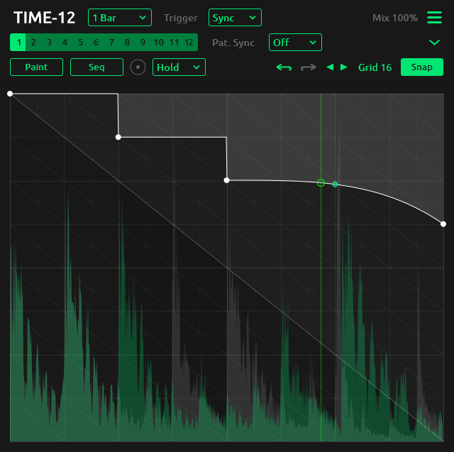

<h1 align="center">
  <!--  -->
  TIME-12
  <br>
</h1>
<div align="center">

[](https://github.com/tiagolr/time12/releases)
[](https://github.com/tiagolr/time12/releases)
[](https://github.com/tiagolr/time12/releases)

</div>
<div align="center">

[](https://github.com/tiagolr/time12/releases/latest)


</div>

**TIME-12** is a cross-platform is a delay modulator inspired by plugins like GrossBeat and ShaperBox. It can be used for a wide range of effects like stuttering, tape stop, glitch, scratch, reverse, pitch shift and more. It is the second version of [TIME-1](https://github.com/tiagolr/time1) rebuilt from scratch using the _JUCE_ framework.

<div align="center">



</div>


Also check other plugins from this collection:

* [GATE-12](https://github.com/tiagolr/gate12) - An envelope generator for volume/gate control.
* [FILT-R](https://github.com/tiagolr/filtr) - An envelope based filter modulator.


## Whats new

  * **Cross-platform** available on Windows, macOS and Linux
  * **Presets** included
  * **Audio trigger** uses audio transients to trigger the envelope
  * **Pattern sync** changes to beat position
  * **Multi-point** selection dragging, scaling and skewing
  * **Paint-mode** revamped with user patterns painted on view
  * **Rotate patterns** no longer constrained by start and end points
  * **Undo & Redo** supported
  * **Sequencer** built-in to quickly build and randomize patterns
  * Other **improvements and fixes**

## Features

  * Multi-segment editor
  * 12 patterns triggered by midi notes
  * Paint mode with user defined shapes
  * Point type - hold, curve, s-curve, stairs ..
  * Tempo sync or lfo rate (Hz)
  * MIDI trigger mode
  * Audio trigger mode
  * Sequencer and randomizer

## Download

* [Download latest release](https://github.com/tiagolr/time12/releases)
* Current builds include VST3 and LV2 for Windows, Linux and macOS plus AU for macOS.
* Clap is planned when there is official [JUCE support](https://juce.com/blog/juce-roadmap-update-q3-2024/).

## About

TIME-12 is an envelope based plugin that combines some of the best features of GrossBeat and ShaperBox, it includes a point system very similar to GrossBeat but also with some great features of ShaperBox like self repeating patterns, multi-point selections that can be scaled or skewed, audio envelope triggering and more.

With version 2 this plugin was rebuilt from scratch using JUCE for its cross-platforms capabilities, maintainability and overall development tools/processes.

### Features

#### Point types

Like GrossBeat, TIME-12 includes 8 point types that can be changed by right clicking a point, the default point type can also be changed in the tools-bar.


#### Paint mode

Paint mode was remade in version 2, it now works with custom patterns that can be edited like the main audio patterns and rescaled before placing on view.

This mode has to be activated by clicking the `Paint` button, a list of patterns will show above the editor window.


There are 32 patterns that can be used and edited, these patterns are saved in the settings file and shared by any instances of the plugin.

#### Self repeating patterns

Patterns are not constrained by start and endpoints like they used to, they can have only one point or no points, this mainly allows patterns to be seamlessly rotated to create new rhythm variations.

#### Multi-point selections

Multiple points can be selected and moved around, the selections can also be scaled and skewed by holding `Alt + drag` the leftmost or rightmost handles, this allows to quickly make rising or falling wedges as well as compress or expand sets of points.


#### Audio Trigger

Audio transients can be used to trigger the envelope or restart its cycle, its heavily based on ShaperBox and includes two modes of detection: *Simple* - based on envelope following and *Drums* - based on total energy during a small time window. This feature is also heavily based on ShaperBox and also allows to use sidechain as input.

#### MIDI Trigger

MIDI can be used to trigger the envelope or restart its cycle, it can also be used to change patterns (defaults to channel 10).

#### Pattern sync

Pattern changes can be synced to the playback beat position, this allows for to make timely transitions in real time in sync with the song position.

#### Sequencer

Clicking the `Seq` button toggles the sequencer mode where patterns can be built and randomized with ease.


The left buttons are the edit mode used when clicking the view. On the right there is a row of shapes used to draw on the view and below is the randomization of the current selected mode.

After creating a sequence click `Apply` to save it as the current pattern and edit from there.

## Tips

- `Shift` for fine slider adjustments.
- `Shift` toggles snap on/off.
- `Mouse wheel` on view changes grid size
- `Right click` points changes point type.
- `Alt + click` inserts new points.
- `Alt + drag` selection handles skews selected points.
- `Right click + drag` in paint mode changes paint tool tension.
- `Shift + mouse wheel` changes sequencer step size.

## MacOS

MacOS builds are untested and unsigned, please let me know of any issues by opening a ticket, don't expect a promptly fix as I don't have access to that OS.

Because the builds are unsigned you may have to run the following commands:

```bash
sudo xattr -dr com.apple.quarantine /path/to/your/plugins/time12.component
sudo xattr -dr com.apple.quarantine /path/to/your/plugins/time12.vst3
sudo xattr -dr com.apple.quarantine /path/to/your/plugins/time12.lv3
```

The commands above will recursively remove the quarantine flag from the plugins.

## Build

```bash
git clone --recurse-submodules https://github.com/tiagolr/time12.git

# windows
cmake -G "Visual Studio 17 2022" -DCMAKE_BUILD_TYPE=Release -S . -B ./build

# linux
sudo apt update
sudo apt-get install libx11-dev libfreetype-dev libfontconfig1-dev libasound2-dev libxrandr-dev libxinerama-dev libxcursor-dev
cmake -G "Unix Makefiles" -DCMAKE_BUILD_TYPE=Release -S . -B ./build
cmake --build ./build --config Release

# macOS
cmake -G "Unix Makefiles" -DCMAKE_BUILD_TYPE=Release -DCMAKE_OSX_ARCHITECTURES="x86_64;arm64" -S . -B ./build
cmake --build ./build --config Release
```
